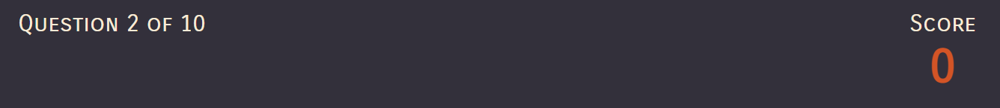

# Project 2 - Halloween Quiz  

### This halloween quiz has been created to provide entertainment to anyone looking for a fun activity to whilst they clebrate hallowen at the end of this month, it contains 10 questions on all related to halloween. 

# Features

## Hompage 
- When the webiste loads the user is greeted with the page title and and instructions to click the start button to begin the quiz. 

## Question and Answer display 
- When the user selects an answer from the list of options presented to them under the question, when it has been clicked on the background of the option will turn green if they have chosen the correct answer and red if they have chosen the wrong answer. 

 

## Question Counter and Scores
- At the top of the page above the question, the user can see which question the are on and what their current score is,

## End page 
- When they have answerd all 10 questions they will be presented with an end page informing them that they have completed the quiz. There is a home page button that the user can click that will take them to the quiz home page. 

# Future Ideas
- In furture i think it would be a nice idea to add in extra rounds with different levels of diffuclty.
- I also think it be a good idea to make a this into a series and have a quiz for each notable holiday/festival that happens during the calender year e.g Easter, Valentines Day, Christmas etc.

# Testing

# Deployment

- This site was deployed using github pages. please find a live link the webisite below.

https://laurenbrown-code.github.io/Project2/

# Credits

- I followed a tutorial on YouTube [here](https://www.youtube.com/watch?v=f4fB9Xg2JEY&t=584s) to create this quiz, it walked me through the creation of the javascript code i have used in my project. 
- I also viewed several pages on the [MDN Web Docs](https://developer.mozilla.org/en-US/) and the [W3Schools](https://www.w3schools.com/) to try and better my understanding of Javascript functions and elements 
- I visited thw following three website to find the questions used in the quiz:
   - https://icebreakerideas.com/halloween-trivia/ 
   - https://pubquizquestionshq.com/categories/halloween
   - https://parade.com/1066846/jessicasager/halloween-trivia/